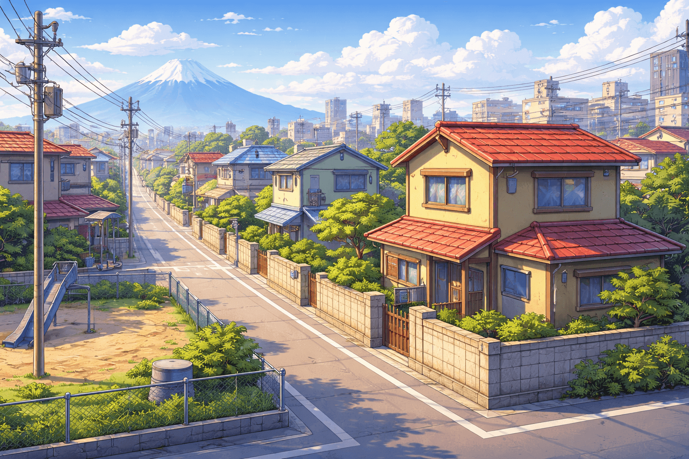

# 🚪 Nobita's Great Escape

> **"Doraemooon! Help me!!"** > A strategic puzzle game where you help Nobita outsmart Gian, Suneo, and Sensei to reach safety.

 ## 📖 About The Project

**Nobita's Great Escape** is a turn-based strategy puzzle game built with vanilla JavaScript and the HTML5 Canvas API. Unlike standard mazes, this game uses a **Non-Planar Graph** structure where paths cross over each other, creating complex "choke points" and traps.

The player controls **Nobita**, who must navigate a neighborhood map to reach **Doraemon** and receive a secret gadget. However, three distinct AI enemies are hunting him down, each with a unique behavior pattern.

## ✨ Key Features

* **🧠 Smart "Pincer" AI:**
    * **Gian:** Aggressive chaser who cuts off the shortest path.
    * **Suneo:** "Camper" logic that predicts your movement and blocks mid-map hubs.
    * **Sensei:** Zones areas to trap you in dead ends.
* **🕸️ Complex Graph Topology:** A custom-built 35-node mesh with hidden "switchback" routes essential for victory.
* **📱 Fully Responsive:** Works perfectly on Desktop, Tablets, and Mobile phones (supports Touch Events).
* **🎨 Polished UI:** Features Glassmorphism overlays, "Juicy" animations, and dynamic feedback.
* **🎁 Gadget Randomizer:** Winning the game rewards you with a random gadget from Doraemon's 4D pocket (e.g., Anywhere Door, Bamboo Copter).

## 🛠️ Tech Stack

* **Frontend:** HTML5, CSS3 (Flexbox, CSS Variables)
* **Logic:** Vanilla JavaScript (ES6+)
* **Rendering:** HTML5 Canvas API (60FPS rendering loop)
* **Algorithms:** Breadth-First Search (BFS) for pathfinding, Linear Interpolation (Lerp) for smooth animations.

## 🎮 How To Play

1.  **Objective:** Move Nobita (Yellow) to Doraemon (Blue/Goal) without landing on the same spot as an enemy.
2.  **Controls:**
    * **Desktop:** Click on any connected node (highlighted with a red pulse) to move.
    * **Mobile:** Tap on the circles to move.
3.  **Rules:**
    * It is turn-based. You move once, then *all* enemies move once.
    * If an enemy catches you, it's **Game Over**.
    * If you reach Doraemon, you **Win**!

## 🚀 Installation & Setup

No build tools or servers required! This is a static web project.

1.  **Clone the repository** (or download the files):
    ```bash
    git clone [https://github.com/yourusername/nobita-escape.git](https://github.com/yourusername/nobita-escape.git)
    ```
2.  **Add Assets:**
    * Ensure you have an `assets/` folder containing images for: `nobita.png`, `gian.png`, `suneo.png`, `sensei.png`, `doraemon.png`, `flag.png`, and `city_bg.png`.
3.  **Run the Game:**
    * Simply open `index.html` in any modern web browser (Chrome, Firefox, Safari).
    * *Optional:* Use the "Live Server" extension in VS Code for the best experience.

## 📂 Project Structure

```text
/nobita-escape
│
├── index.html        # Game container and UI overlays
├── style.css         # Styling, animations, and responsive layout
├── script.js         # Game loop, Graph logic, AI, and Canvas rendering
├── /assets           # Character sprites and background images
└── README.md         # You are here!
``
## ⚖️ Disclaimer & Credits
This project is a non-profit fan creation made for educational purposes.

Characters & IP: All rights to Doraemon, Nobita Nobi, Takeshi Goda (Gian), Suneo Honekawa, and other related characters belong to Fujiko F. Fujio, TV Asahi, Shin-Ei Animation, and ADK.

Fair Use: This project is not affiliated with or endorsed by the official license holders. No copyright infringement is intended.

Made with ❤️ and a Memory Bread.